<!--
  ============================================================
  README DE PERFIL — Sodré
  Coloque este arquivo em um repositório com o MESMO nome do
  seu usuário do GitHub (ex.: github.com/SEU-USUARIO/SEU-USUARIO)
  junto com banner.svg e terminal.svg, na raiz.
  Onde editar está marcado com  <!== EDITE ==>  ao longo do arquivo.
  ============================================================
-->

<!-- ======================= BANNER ======================= -->

  

 

<!-- ============== TÍTULO (esq.) + TERMINAL (dir.) ============== -->
<table border="0" cellspacing="0" cellpadding="0">
<tr>
<td width="43%" valign="middle">

<h2>&gt; Sodré<code>_</code></h2>
<h3>🧬 A.I. Software Engineer</h3>

<em>Transformo prompts em produto. Turning prompts into product.</em>

🧠&nbsp; ~2 anos de engenharia orientada por IA 
⚡&nbsp; apps · sites · jogos · Roblox · databases 
🔐&nbsp; WebSocket · cripto E2E · P2P descentralizado 
🎯&nbsp; prompt engineering · debug estratégico

<!-- <!== EDITE: troque pelos seus links reais ==> -->

</td>
<td width="57%" valign="middle" align="center">

</td>
</tr>
</table>

<!-- ======================= STACK / BADGES ======================= -->

<!-- <!== EDITE: adicione/remova badges das techs que você usa ==> -->

 

<!-- ======================= MINI DESCRIÇÃO ======================= -->
> 🇧🇷 **Engenheiro de software orientado por IA.** Há cerca de 2 anos transformo ideias em produtos que rodam — de apps e sites a jogos (inclusive Roblox) e bancos de dados para projetos já existentes. Gosto do que é difícil: **WebSocket**, **acesso remoto criptografado ponta a ponta**, **databases blindadas** e **conexões P2P descentralizadas**. Meu diferencial é o processo: prompt engineering afiado e raciocínio lógico pra caçar bugs rápido e maximizar a assertividade.
>
> 🇺🇸 **AI-driven software engineer.** For ~2 years I've been turning ideas into shipped products — apps, websites, games (Roblox included) and databases for existing projects. I like the hard stuff: **WebSockets**, **end-to-end encrypted remote access**, **hardened databases** and **decentralized P2P connections**. My edge is the process: sharp prompt engineering and logical reasoning to hunt bugs fast and maximize precision.

 

<!-- =======================================================================
     LINKS EXPANSÍVEIS
     Cada bloco 
 mostra só o TÍTULO; ao clicar, revela o conteúdo.
     É aqui que você adiciona seus links depois — é só copiar um item e editar.
     ======================================================================= -->

<b>🚀 Projetos em destaque &nbsp;/&nbsp; Featured projects</b>

 

<!-- <!== EDITE: um item por projeto. Troque nome, link e descrição. ==> -->
- **[Nome do Projeto](https://github.com/SEU-USUARIO/projeto)** — o que é, em uma linha. _WebSocket · E2E · P2P_
- **[Outro Projeto](https://link-do-projeto.com)** — descrição curta do que ele faz.
- **[Mais um](https://link.com)** — descrição curta.

<b>🧰 Stack &amp; skills &nbsp;/&nbsp; O que eu uso</b>

 

<!-- <!== EDITE livremente ==> -->
**Engenharia com IA:** prompt engineering, orquestração de agentes, estratégias de debugging assistido, raciocínio lógico aplicado.
**Backend & Redes:** WebSocket, APIs em tempo real, acesso remoto, criptografia ponta a ponta, P2P / arquiteturas descentralizadas.
**Dados:** modelagem e proteção de bancos de dados, segurança de acesso.
**Criação:** apps, sites, jogos web, Roblox / Luau.

<b>📊 GitHub stats</b>

 

<!-- <!== EDITE: troque SEU-USUARIO pelo seu @ do GitHub em TODAS as URLs abaixo ==> -->

<b>📫 Contato &nbsp;/&nbsp; Contact</b>

 

<!-- <!== EDITE: adicione seus links reais ==> -->
- 🌐 Site / Portfolio — **[link](https://seu-site.com)**
- 💬 Discord / X / LinkedIn — **[link](https://link.com)**
- ✉️ E-mail — **[voce@email.com](mailto:voce@email.com)**

 

<!-- ======================= RODAPÉ ======================= -->

<code>&gt;</code> compiling ideas into reality · <b>building with AI</b> <code>_</code>

